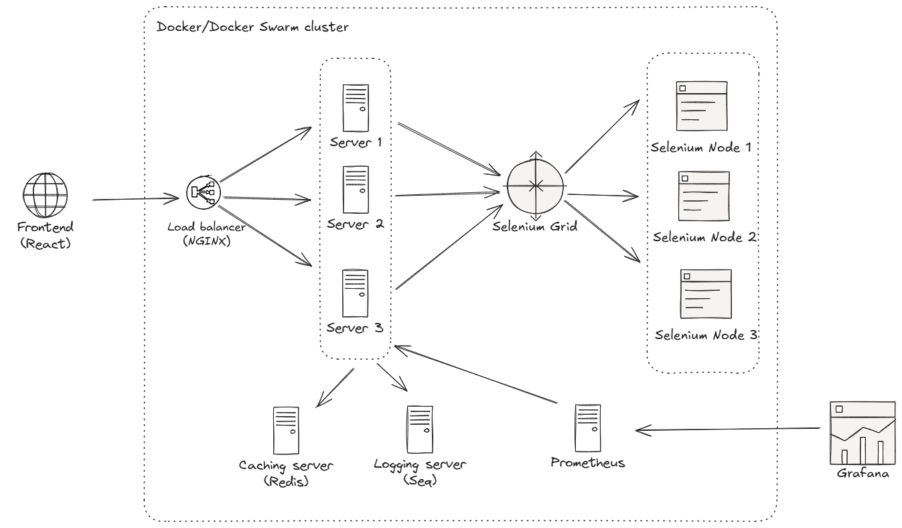

# SEO Ranking System

## **IMPORTANT**: Google Search uses a really advanced bot detection system! I try to use **Selenium** to maximize the chance to get the ranking results, but if the results are not returned, please consider switching to a different network!!!

## Overview
SEO Ranking System is a web application designed to scrape search engine results and rank them based on specified keywords. The backend is built using ASP.NET Core 8, while the frontend is developed using React.

## High-level architecture

## High-level design decisions:
- [**Selenium**](https://www.selenium.dev/documentation/overview/) is used because Google's advanced bot detection system makes scraping the HTML content via simple GET requests really hard.
- [**Selenium Grid**](https://www.selenium.dev/documentation/grid/) is used to distribute the load to scrape the search results to **multiple Selenium nodes/workers**, which makes **horizontal scaling** very easy.
- Currently, the system does not persist data. **TODO** in the future!

## Low-level design details:
### Scraper

## How to run
### With Docker
- In the root folder, simply run `docker compose -f docker-compose.yml -f docker-compose.override.yml up -d` and wait until it finishes.
- Frontend will be served via `http://localhost:3000/`.
- Swagger page will be served via `http://localhost:8888/swagger/index.html`.

### Without Docker
- In the root folder, run `docker compose -f docker-compose.yml -f docker-compose.override.yml up -d seq redis selenium-hub selenium-node-chrome` and wait to start all other services
- To start the backend:
  + Navigate to **/src/Host** folder
  + Run `dotnet restore`, `dotnet build` and then `dotnet run` to start the backend.
  + Swagger page will be served via `http://localhost:8080/swagger/index.html`.
- To start the frontend:
  + Navigate to **fe** folder
  + Run `npm install` and then `npm run dev` to start the frontend. **Remember** to change the env `VITE_API_URL` to `http://localhost:8080/api`!
  + Frontend will be served via `http://localhost:3000/`.

## Backend
The backend of the SEO Ranking System is implemented using ASP.NET Core 8. It includes various services and middleware to handle scraping, caching, logging, and more.

### Key Components
- **Scraper**: Uses Selenium Grid to distribute the load to scrape the search results to multiple Selenium nodes/workers.
- **Caching**: Implements caching to store and retrieve search results efficiently, support Redis cache and local cache.
- **Logging**: Uses Serilog for logging requests and responses, logs will be pushed to a Seq server.
- **Middleware**: Handles exceptions and logs requests and responses.
- **Testing**: Uses **NUnit** as a unit-testing framework and **NSubstitute** as a mocking library.

### Project Structure: Following Clean Architecture
- `src/Host`: Contains the host for the backend.
- `src/Infrastructure`: Contains the infrastructure services and configurations.
- `src/Core/Application`: Contains the application logic and interfaces.
- `tests/Infrastructure.Tests`: Contains unit tests for the infrastructure services.
- `tests/Application.Tests`: Contains unit tests for the application logic.

## Frontend
The frontend of the SEO Ranking System is built using React. It provides a user interface to input keywords and view the search engine rankings.

### Key Components
- **React**: The main library for building the user interface.
- **Vite**: A build tool that aims to provide a faster and leaner development experience for modern web projects
- **Axios**: Used for making HTTP requests to the backend.
- **Tailwind CSS**: Used for styling the application.

### Project Structure
- `fe/src`: Contains the React components and pages.
- `fe/public`: Contains the public assets.

## Contributing
Contributions are welcome! Please fork the repository and submit a pull request with your changes.
